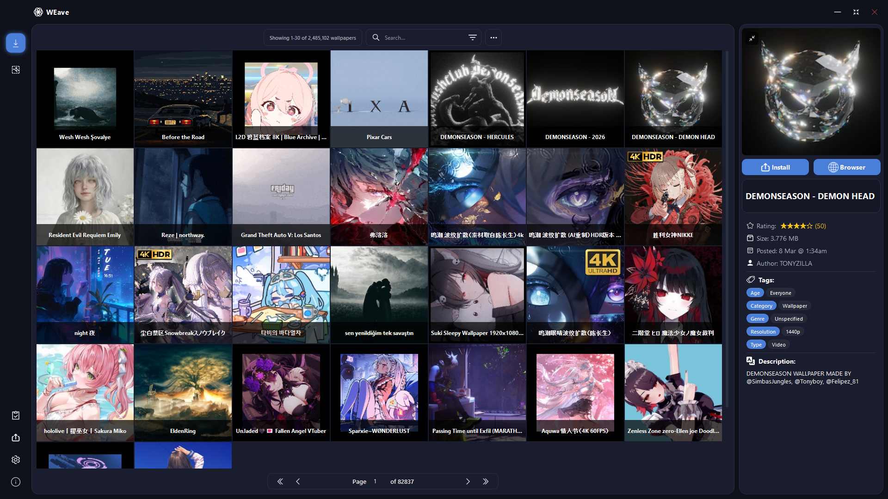

# WE Workshop Manager

<p align="center">
  
</p>

<p align="center">
  <strong>Частичная демонстрация интерфейса</strong>
</p>

<p align="center">
  <a href="LICENSE">
    
  </a>
  <a href="#installation">
    
  </a>
  <a href="#installation">
    
  </a>
</p>

---

WE Workshop Manager — это десктопное приложение на Python/PyQt6, которое позволяет легко загружать, устанавливать и управлять обоями из Steam Workshop для Wallpaper Engine **без необходимости запускать клиент Steam**.

### 🔑 Основные возможности:

- 🌐 Просмотр мастерской Steam и загрузка обоев **в один клик**
- 🗂️ Управление установленными обоями (применение, удаление, извлечение .pkg файлов и прочее)
- 📊 Загрузка обоев по списку ID и\или URL
- 🎯 Отслеживание статуса загрузки\извлечения обоев
- 🌍 Мультиязычность

> [!NOTE]  
> - Обои загружаются в папку по умолчанию для WE, **аналогично обычной установке**  
> - Первый вход может быть долгим, пожалуйста, подождите пока создаются Cookies  
> - Скорось загрузки Workshop зависит от скорости вашего интернет соединения, а так же доступности серверов Steam (Если долго не загружается - перезайдите или нажмите на кнопку Refrash)

> [!WARNING]  
> - Приложение использует **общедоступные аккаунты** для загрузки из мастерской  
> - Приложение **не модифицирует** оригинальный клиент Wallpaper Engine или Steam  
> - Автор **не поддерживает** использование данного ПО для получения материальной выгоды, используйте его лишь как альтернативу с доп. функционалом или при невозможности приобрести лицензионную версию по региональным ограничениям :)  

---

## 🚀 Установка

### 📦 Вариант 1: Упакованная через PyInstaller версия

Скачайте последнюю версию из раздела **[Releases](https://github.com/psyattack/we-workshop-manager/releases)**  
> Все зависимости уже есть в архиве, просто распакуйте архив в удобное место и запустите `WE Workshop Manager.exe`

---

### 💻 Вариант 2: Запуск из исходного кода

#### 0. Первоначальная настройка

Установите Python версии 3.10 или выше с [оффициального сайта](https://www.python.org/downloads), если ещё не сделали это  
Приложение тестировалось на версии Python 3.14.2

#### 1. Клонирование или загрузка репозитория

```bash
git clone https://github.com/psyattack/we-workshop-manager.git
cd we-workshop-manager
```
> Или просто скачайте исходный код прямо с репозитория и перейдите в папку с проектом `cd ваш_путь\we-workshop-manager`

#### 2. Установка зависимостей Python

```bash
pip install -r requirements.txt
```

#### 3. Загрузка необходимых компонентов

| Компонент | Куда поместить |
|-------------|----------------|
| [DepotDownloaderMod](https://github.com/SteamAutoCracks/DepotDownloaderMod/releases) | `Plugins/DepotDownloaderMod/` |
| [RePKG](https://github.com/notscuffed/repkg/releases) | `Plugins/RePKG/` |
| [.NET 9 Desktop Runtime](https://dotnet.microsoft.com/en-us/download/dotnet/9.0/runtime) | Установите глобально |

#### 4. Запуск приложения

```bash
python main.py
```

---

## 📁 Структура проекта

```
we-workshop-manager/
├── core/                  # Основная логика (аккаунты, загрузки, интеграция с WE)
├── ui/                    # Интерфейс (вкладки, виджеты, темы)
├── localization/          # Файлы локализации (en.json, ru.json)
├── resources/             # Скрипты для браузера и ресурсы
├── utils/                 # Вспомогательные утилиты
├── Plugins/               # Утилиты DepotDownloaderMod и RePKG (загружать отдельно)
├── Packages/              # Установщик .NET (загружать отдельно)
├── app.py                 # Точка входа
└── requirements.txt       # Зависимости Python
```

---

## 🙏 Благодарности

Этот проект использует следующие открытые ресурсы и инструменты:

- **[DepotDownloaderMod](https://github.com/SteamAutoCracks/DepotDownloaderMod)** — модифицированный загрузчик мастерской
- **[RePKG](https://github.com/notscuffed/repkg)** — инструмент распаковки .pkg файлов
- **[WallpaperEngineWorkshopDownloader](https://github.com/SteamAutoCracks/WallpaperEngineWorkshopDownloader)** — за предоставление аккаунтов для загрузки из мастерской
- **[icons8](https://icons8.com)** — бесплатные иконки для интерфейса

---

## 📜 Лицензия

Этот проект распространяется под лицензией **[MIT](LICENSE)**.

---

## 👁️‍🗨️ Известные проблемы

- [ ] Поиск частично отличается от версии на сайте
- [ ] Некорректное возвращение состояния окна после предварительного сворачивания

---

## 📋 TODO & Support

- [ ] Автоматическое обновление
- [ ] Выявление и устранение редких багов
- [ ] Добавление тем\вида UI
- [ ] Доработка до полной идентичности функционала Workshop
- [ ] Доработка локализации
- [ ] Масштабирование элементов интерфейса под разные размеры и форматы экранов

> Если у вас возникли проблемы или есть предложения по улучшению — создайте [Issue](https://github.com/psyattack/we-workshop-manager/issues) в репозитории.

---