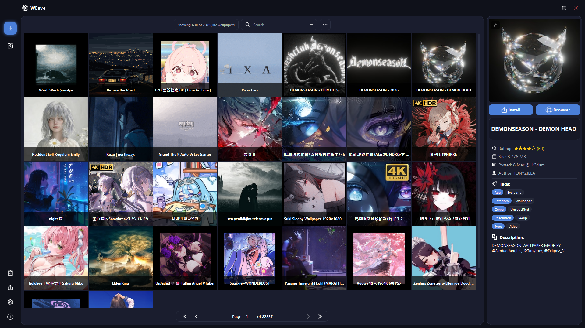

# WE Workshop Manager

<p align="center">
  <a href="README.md">🇷🇺 Русский</a> |
  <a href="README.en.md">🇬🇧 English</a> |
  <a href="README.de.md">🇩🇪 Deutsch</a> |
  <a href="README.es.md">🇪🇸 Español</a> |
  <a href="README.fr.md">🇫🇷 Français</a> |
  <a href="README.ja.md">🇯🇵 日本語</a> |
  <a href="README.pt.md">🇧🇷 Português</a> |
  <a href="README.zh.md">🇨🇳 中文</a>
</p>

<p align="center">
  
</p>

<p align="center">
  <strong>Teilweise Demonstration der Benutzeroberfläche</strong>
</p>

<p align="center">
  <a href="../LICENSE">
    
  </a>
  <a href="#installation">
    
  </a>
  <a href="#installation">
    
  </a>
</p>

---

WE Workshop Manager ist eine Python/PyQt6 Desktop-Anwendung, die es Ihnen ermöglicht, Wallpaper aus dem Steam Workshop für Wallpaper Engine einfach herunterzuladen, zu installieren und zu verwalten **ohne den Steam-Client starten zu müssen**.

### <strong>Seit Version 1.3.7 laden Workshop-Seiten mit der neuen Funktion Preload Next Page (BETA) sogar schneller als im Browser!</strong>

### 🔑 Hauptfunktionen:

- 🌐 Steam Workshop durchsuchen und Wallpaper **mit einem Klick** herunterladen
- 🗂️ Installierte Wallpaper verwalten (anwenden, entfernen, .pkg-Dateien extrahieren, etc.)
- 📊 Wallpaper nach Liste von IDs und/oder URLs herunterladen
- 🎯 Download-/Extraktionsstatus von Wallpaper verfolgen
- 🌍 Mehrsprachig
- ⚜️ Themes
- 🔰 Viele weitere Funktionen

> [!NOTE]  
> - Wallpaper werden in den Standard-WE-Ordner heruntergeladen, **ähnlich einer normalen Installation**  
> - Die erste Anmeldung kann lange dauern, bitte warten Sie, während Cookies erstellt werden  
> - Die Workshop-Download-Geschwindigkeit hängt von Ihrer Internetverbindungsgeschwindigkeit ab, sowie von der Verfügbarkeit der Steam-Server (Wenn das Herunterladen zu lange dauert - melden Sie sich erneut an oder klicken Sie auf die Schaltfläche "Aktualisieren")

> [!WARNING]  
> - Die App verwendet **öffentliche Konten** zum Herunterladen aus dem Workshop  
> - Die App **modifiziert nicht** den originalen Wallpaper Engine- oder Steam-Client  
> - Der Autor **unterstützt nicht** die Verwendung dieser Software für finanzielle Gewinne, verwenden Sie sie nur als Alternative mit zusätzlichen Funktionen oder wenn Sie aufgrund regionaler Einschränkungen keine lizenzierte Version erwerben können :)  

> [!WARNING]  
> Wenn die App jemals die Anzeige von "bestimmten" Inhalten im Workshop verweigert, bedeutet dies, dass das Systemkonto aus irgendeinem Grund nicht angemeldet wurde. Sie müssen sich in den App-Einstellungen in ein beliebiges Steam-Konto (ohne Steam Guard und mit den gewünschten Inhaltseinstellungen) anmelden.  
> Ähnlich beim Herunterladen, wenn Wallpaper nicht geladen werden - versuchen Sie, ein anderes Konto aus der Liste auszuwählen.

---

## 🚀 Installation

### 📦 Option 1: Verpackte PyInstaller-Version

Laden Sie die neueste Version aus dem **[Releases](https://github.com/psyattack/we-workshop-manager/releases)**-Bereich herunter  
> Alle Abhängigkeiten sind bereits im Archiv enthalten, entpacken Sie das Archiv einfach an einen convenienten Ort und führen Sie `WE Workshop Manager.exe` aus

---

### 💻 Option 2: Ausführung aus dem Quellcode

#### 0. Ersteinrichtung

Installieren Sie Python Version 3.10 oder höher von der [offiziellen Website](https://www.python.org/downloads), falls noch nicht geschehen  
Die App wurde auf Python 3.14.2 getestet

#### 1. Klonen Sie das Repository

```bash
git clone https://github.com/psyattack/we-workshop-manager.git
cd we-workshop-manager
```

#### 2. Installieren Sie Python-Abhängigkeiten

```bash
pip install -r requirements.txt
```

#### 3. Laden Sie erforderliche Komponenten herunter

| Komponente | Wohin platzieren |
|-------------|----------------|
| [DepotDownloaderMod](https://github.com/SteamAutoCracks/DepotDownloaderMod/releases) | `Plugins/DepotDownloaderMod/` |
| [RePKG](https://github.com/notscuffed/repkg/releases) | `Plugins/RePKG/` |
| [.NET 9 Desktop Runtime](https://dotnet.microsoft.com/en-us/download/dotnet/9.0/runtime) | Global installieren |

#### 4. Führen Sie die Anwendung aus

```bash
python app.py
```

---

## 📁 Projektstruktur

```
we-workshop-manager/
├── core/                  # Kernlogik
├── ui/                    # Benutzeroberfläche
├── localization/          # Lokalisierungsdateien
├── resources/             # Ressourcen
├── utils/                 # Hilfsprogramme
├── Plugins/               # DepotDownloaderMod und RePKG Utilities (separat herunterladen)
├── Packages/              # .NET Installer (separat installieren)
├── app.py                 # Einstiegspunkt
└── requirements.txt       # Python-Abhängigkeiten
```

---

## 🙏 Danksagungen

Dieses Projekt verwendet die folgenden offenen Ressourcen und Werkzeuge:

- **[DepotDownloaderMod](https://github.com/SteamAutoCracks/DepotDownloaderMod)** — modifizierter Workshop-Downloader
- **[RePKG](https://github.com/notscuffed/repkg)** — .pkg-Datei-Auspacker-Tool
- **[WallpaperEngineWorkshopDownloader](https://github.com/SteamAutoCracks/WallpaperEngineWorkshopDownloader)** — für die Bereitstellung von Konten zum Herunterladen aus dem Workshop
- **[icons8](https://icons8.com)** — kostenlose Icons für die Benutzeroberfläche

---

## 📜 Lizenz

Dieses Projekt ist unter der **[MIT](LICENSE)**-Lizenz lizenziert.

---

## 👁️‍🗨️ Bekannte Probleme

- [ ] Suche unterscheidet sich teilweise von der Website-Version
- [ ] Falsches Fensterzustand-Rückgabe nach dem Minimieren

---

## 📋 TODO & Support

- [x] Themes
- [x] Anmeldung über persönliches Steam-Konto (Zur Verwendung bei Steam failed 50 und ähnlichem)
- [ ] Autostart
- [ ] Tray + stiller Modus
- [ ] Original WE-Funktionen (Preset-Editor, Playlists erstellen, Profile, etc.)
- [ ] Automatische Updates
- [ ] Benutzeroberfläche für verschiedene Bildschirmgrößen und Formate optimieren

> Wenn Sie Probleme haben oder Verbesserungsvorschläge — erstellen Sie ein [Issue](https://github.com/psyattack/we-workshop-manager/issues) im Repository.

---
